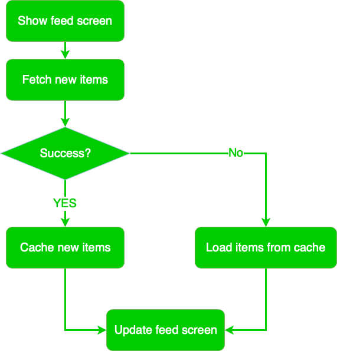

# EssentialFeed
Implementing the example project for the iOS Lead Essentials course    
	
# Specification (User Stories)

---

Give some assistive rules on how to write good stories and narratives.

# Story: Customer requests to see the feed

## Narrative #1

> As an online customer  
> I want the app to load the feed  
> So I can see the feed

### Scenarios (Acceptance Criteria)
```
Given the customer has connectivity
When the customer requests to see the feed
Then the app should display the latest feed from remote
And replace the cache with the new feed  
```

## Narrative #2

> As an offline customer  
> I want the app to show the latest saved version of my image feed   
> So I can always enjoy images of my friends   

### Scenarios (Acceptance Criteria)
```
Given the customer has no connectivity
When the customer requests to see the feed
Then the app should display the latest saved feed 
```

``` 
Given the customer has no connectivity
And the cache is empty
When the customer requests to see the feed
Then the app should display an error message  
```

# Use Cases

---

# Use Case #1: Load Feed

## Data:
* URL

## Primary course (happy path):
1. Execute "Load Feed Items" command with above data
2. System downloads data from the URL.
3. System validates downloaded data.
4. System creates feed items from valid data.
5. System delivers feed items.

## Invalid data - error course (sad path):
1. System delivers error.

## No connectivity - error course (sad path):
1. System delivers error.


# Use Case #2: Load Feed Fallback (Cache)

## Data:
* Max age

## Primary course (happy path):
1. Execute "Retrieve Feed Items" command with above data
2. System fetches feed data from cache.
3. System creates feed items from cached data.
4. System delivers feed items.

## Empty Cache (sad path)
1. System delivers error.


# Use Case #3: Save Feed Items

## Data:
* Feed items

## Primary course (happy path):
1. Execute "Save Feed Items" command with above data
2. System encodes feed items.
3. System timestamps the new cache.
4. System replaces the cache with new data.
5. System delivers success message.

## Empty Cache (sad path)
1. System delivers error.


# Flowchart



# Architecture


# Model Specs

## Feed Item

|  Property    |   Type             |
|--------------|--------------------|
| id           | UUID               |
|--------------|--------------------|
| description  | String (optional)  |
|--------------|--------------------|
| location     | String (optional)  |
|--------------|--------------------|
| imageURL     | URL                |
|--------------|--------------------|